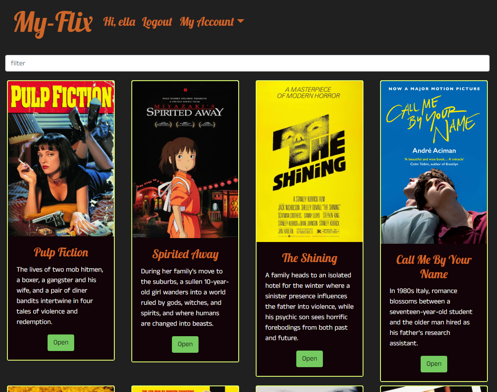
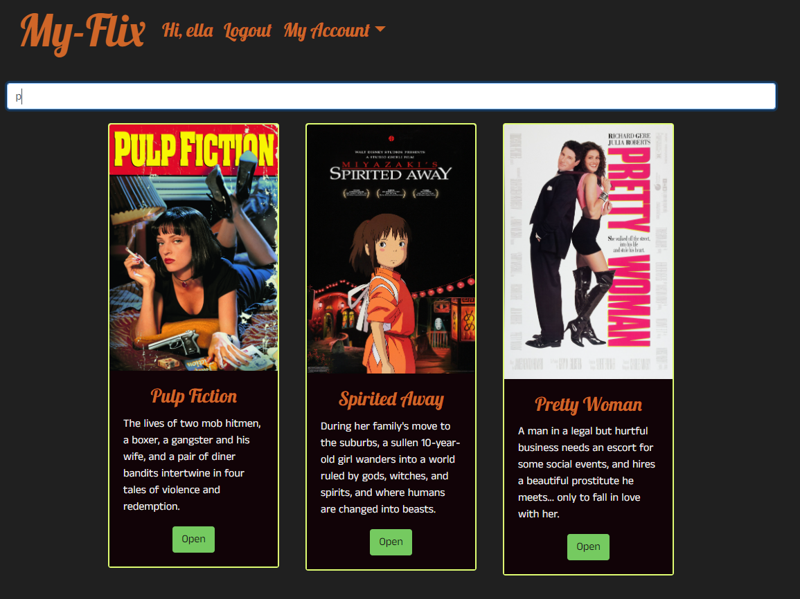
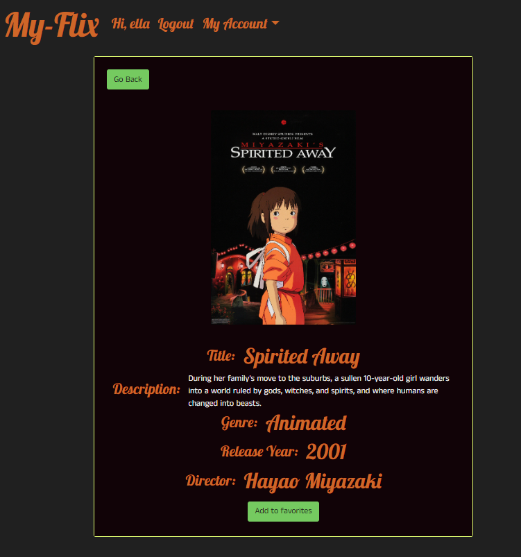
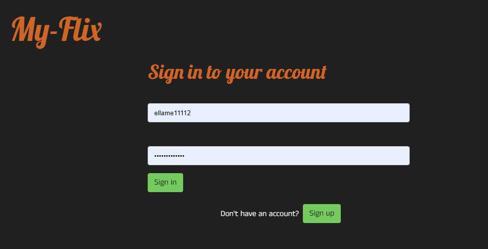
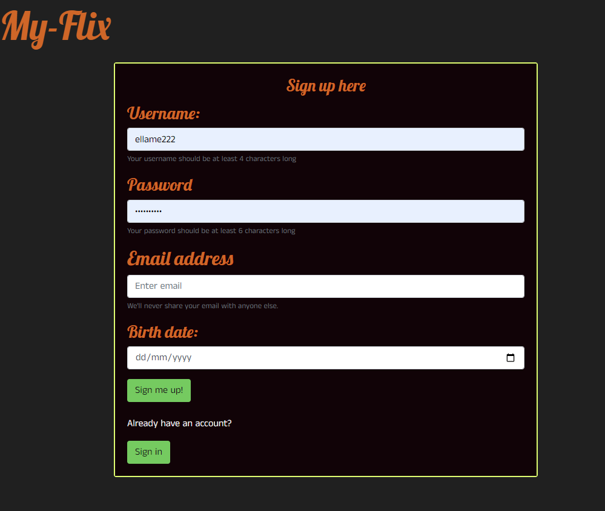
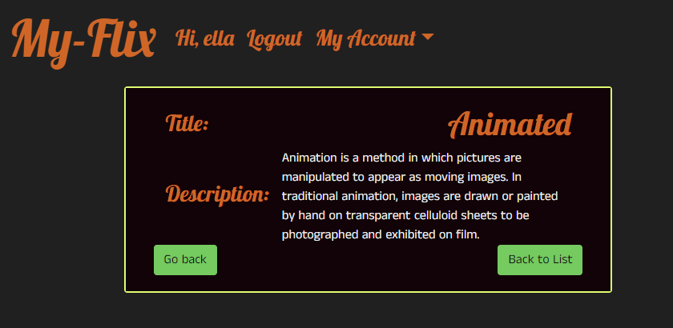
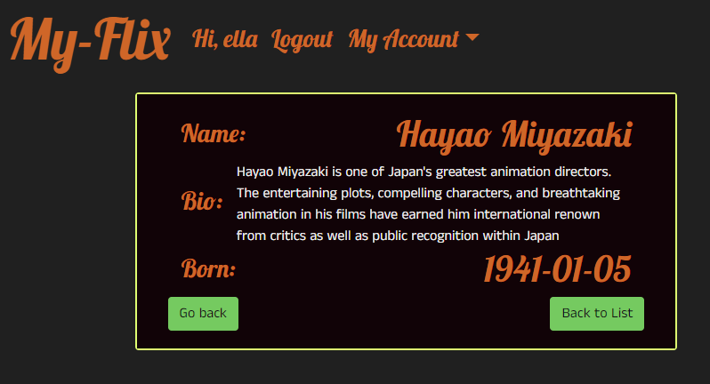
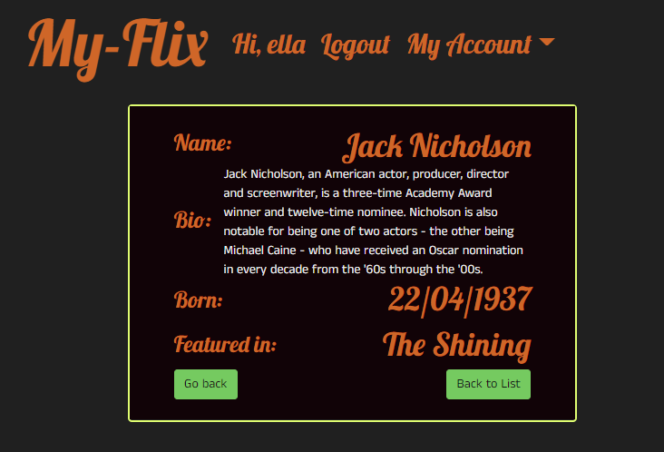
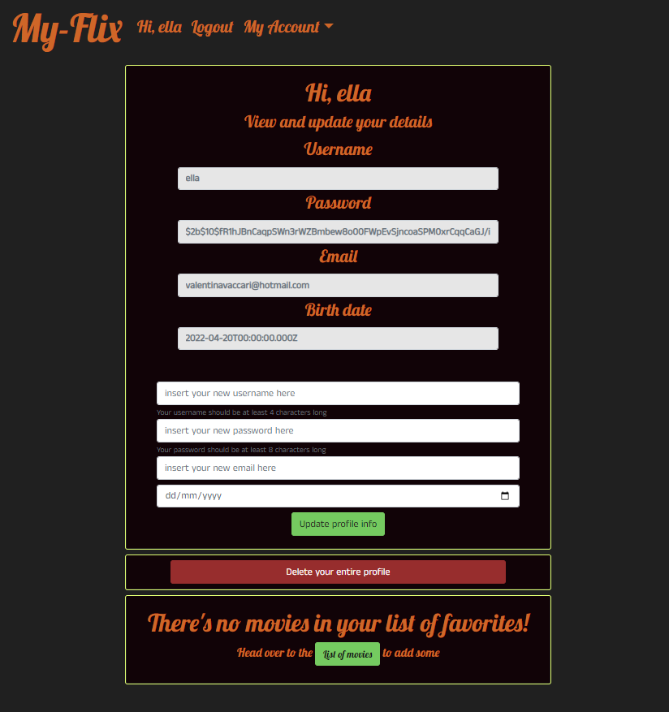

# myFlix-client
MyFlix is a small app that showcases various informations from a small database (REST API) of movies. Users can register, update/add information about themselves (securely via password hashing) and add/remove movie titles to a list of their favourites. 

The client-side for myFlix is developed using REACT, HTML5, and SCSS

The server-side development for myFlix can be accessed [here](https://github.com/valvegan/movie_api)

## A live preview of the app can be accessed [here](https://valentina-my-flix-client.netlify.app/)

## Build tools: Parcel

## App features
### Essential Views and Features:

### Main view
 
- [x] Returns a list of ALL movies to the user (each listed item with an image, title, and description)
- [x] Sorting and filtering
- [x] Ability to select a movie for more details

### Single movie view

- [x] Returns data (description, genre, director, image) about a single movie to the user
- [x] Allows users to add a movie to their list of favorites
- [x] Allow users to view more information about different movies, such as the release date and
the movie rating

### Login view

- [x] Allows users to log in with a username and password

### Registration view

- [x] Allows new users to register (username, password, email, birthday)

### Genre view

- [x] Returns data about a genre, with a name and description
- [x] Displays example movies

### Director view

- [x] Returns data about a director (name, bio, birth year, death year)
- [x] Displays example movies

### Actors view

- [x] Allows users to view information about different actors

### Profile view

- [x] Allows users to update their user info (username, password, email, date of birth)
- [x] Allows existing users to deregister
- [x] Displays favorite movies
- [x] Allows users to remove a movie from their list of favorites

## Launch
1)
1) Install parcel locally 
>npm install --save-dev parcel @parcel/transformer-sass

2) Run parcel build
>npm run start

3) Navigate to http://localhost:1234 
